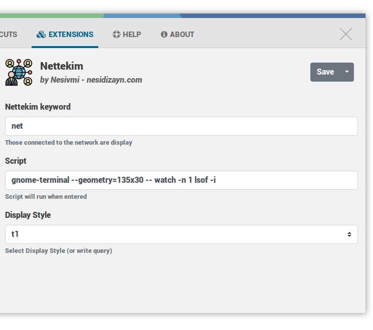

# Ulauncher Nettekim

[](https://github.com/nesivmi/ulauncher-nettekim)

> [Nettekim](https://github.com/nesivmi/ulauncher-nettekim) Display list of files connecting to the internet

## Preview


## Requirements

* [Ulauncher](https://github.com/Ulauncher/Ulauncher) 5.0+
* [Gnome-Terminal](https://help.ubuntu.ru/wiki/gnome_terminal) '''sudo apt-get install gnome-terminal'''
* [lsof](https://www.linuxtechi.com/lsof-command-examples-linux-geeks/)  It usually comes loaded.


## Install

Open ulauncher preferences window -> extensions -> add extension and paste the following url:

```
https://github.com/nesivmi/ulauncher-nettekim
```

## Usage
* > net
* > net t0            -->   Display style 1
* > net t1            -->   Display style 2
* > net t6 firefox    -->   Display style 6 and lists the objects that contain firefox.
```
```
## Prefrences

* **Nettekim** - Main extension keyword. You can change.
* **Script** - Script will run when item clicked
* **Display Style** - t0 or t1


## Links

* [Ulauncher Extensions](https://ext.ulauncher.io/)
* [Ulauncher 5.0 (Extension API v2.0.0) — Ulauncher 5.0.0 documentation](http://docs.ulauncher.io/en/latest/)
